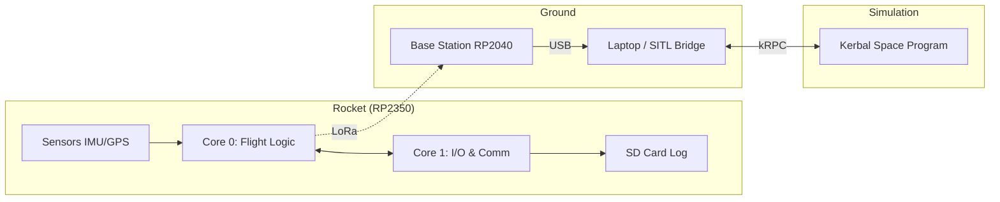

# rocket_vR


An embassy-based Rust firmware for the Raspberry Pi Pico 2 W (RP2350) and RP2040.

`rocket_vR` is a flight control system designed for high-reliability Model Rocketry. It leverages the [Embassy](https://embassy.dev/) async framework to provide efficient task management, low power consumption, and deterministic timing.

## 🚀 Key Features

- **🛡️ Dual-Core Isolation**: Critical flight logic is strictly isolated to Core 0, while I/O and background tasks run on Core 1.
- **⏱️ 100Hz Control Loop**: Prioritized task execution with precision-locked timing and automated data staleness detection.
- **🧠 Robust Panic Recovery**: Bi-directional cross-core monitoring and post-mortem crash reporting using persistent `.uninit` RAM.
- **📡 Integrated Telemetry**: 915MHz LoRa-based telemetry combined with an asynchronous, block-aligned SD card logging pipeline.
- **🎮 SITL-Ready**: High-fidelity Software-in-the-Loop bridge for real-time testing in **Kerbal Space Program**.

## Getting Started

### Prerequisites

1.  **Rustup**: Install Rust from [rust-lang.org](https://rust-lang.org/learn/get-started/).
2.  **Toolchain**:
    ```bash
    rustup target add thumbv8m.main-none-eabihf # For Pico 2
    rustup target add thumbv6m-none-eabi        # For Pico
    cargo install elf2uf2-rs probe-rs
    ```
3.  **Picotool**: Required for loading firmware via USB.

### Building and Running

Use the provided Cargo aliases to simplify building for different targets:

#### For Pico 2 (RP2350)
```powershell
cargo run-pico2        # Build and Run
cargo build-pico2  # Build only
```

#### For Pico (RP2040)
```powershell
cargo run-pico         # Build and Run
cargo build-pico   # Build only
```

## Project Structure

- **`rocket-core/`**: Core state machine and shared data structures.
- **`rocket-drivers/`**: Hardware-specific drivers (IMU, GPS, Radio, SD).
- **`rocket-os/`**: Abstraction layer for OS-level features like utilization tracking.
- **`base-station/`**: Firmware for the ground station receiver.
- **`rocket-sitl-ksp/`**: SITL bridge for Kerbal Space Program.

## 🏗️ High-Level System Architecture



## Documentation

For more in-depth information, please refer to the following guides:

- [**🚀 SITL Quick-Start Guide**](docs/sitl_guide.md): Get up and running with Kerbal Space Program simulations.
- [**🏗️ Architecture & Design**](docs/architecture.md): Timing models, task types, and panic handling.
- [**🔌 Hardware & Wiring**](docs/hardware.md): Bill of Materials (BOM) and pin assignments.
- [**🧠 The Brain (rocket-core)**](rocket-core/README.md): Blackboard pattern and flight logic.
- [**📦 Peripheral Drivers (rocket-drivers)**](rocket-drivers/README.md): Sensor drivers and bus management.
- [**🛠️ OS Layer (rocket-os)**](rocket-os/README.md): Instrumented executor and health monitoring.
- [**❓ Troubleshooting**](docs/troubleshooting.md): Common issues and solutions.

## License

This project is licensed under the MIT License - see the [LICENSE](LICENSE) file for details.