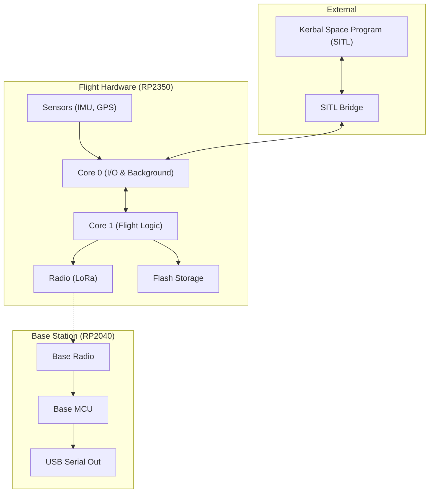
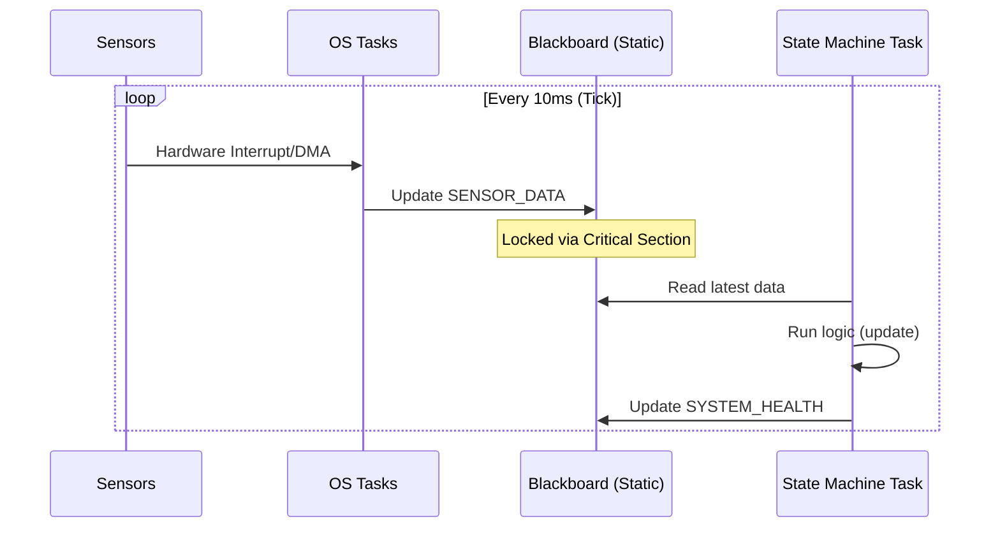

# Architecture & Design

This document details the internal workings, timing constraints, and task structure of the `rocket_vR` firmware.

## System Overview



## Timing Model

The system targets a **100Hz** update loop (10ms per tick) using a prioritized task layout to ensure that data recorded is at most a single tick old.

### Timing Chart

| Time | State Machine Task                     | Input Task              | Output Task         |
| ---- | -------------------------------------- | ----------------------- | ------------------- |
| Tick | Copy data from input CHANNELS          | _waiting_               | _waiting_           |
| +1   | Calculate **State**                    | _waiting_               | _waiting_           |
| +2   | store data into output CHANNELS        | _waiting_               | _waiting_           |
| +3   | Signal to Output & Data Tasks to Start | _waiting_               | _waiting_           |
| +4   | Start STORE operation into Flash       | *Start Input*           | *Start Output*      |
| +5   | _waiting_                              | Send communications     | Set Outputs         |
| +5   | _waiting_                              | _waiting_               | *End Output*        |
|...   ||||
| +n   | Store completes, await next Tick       | _waiting_               | _waiting_           |
|...   ||||
| +m   | _waiting_                              | Comm Received           | _waiting_           |
| +m   | _waiting_                              | data conversion         | _waiting_           |
| +m1  | _waiting_                              | store data into CHANNEL | _waiting_           |
| +m1  | _waiting_                              | *End Input*             | _waiting_           |
|Go to Tick ||| |

### Data Flow



### Execution Order
- The Embassy executor uses a run-queue; execution order isn't strictly guaranteed by the OS.

## Task Types

### State Machine (Singleton)
Using the `embassy_timer::Ticker`, this task handles the core business logic (e.g., "In this state, fire Pyro 1"). It triggers data logging and signals data collection tasks at every tick.

```mermaid
stateDiagram-v2
    [*] --> Initializing
    Initializing --> GroundIdle: Ground Reference Set
    GroundIdle --> PoweredFlight: Velocity > 1m/s OR Accel > 2G
    PoweredFlight --> Coasting: Burnout Detected (Low Accel/Velocity Drop)
    Coasting --> ApogeeReached: Altitude Drop > 3m (Safety Armed)
    ApogeeReached --> Descent: Automatic
    Descent --> Landed: Velocity ~ 0
    Landed --> [*]

    state PoweredFlight {
        [*] --> Burning
    }
    
    note right of ApogeeReached
        Action: Deploy Parachutes
    end
    
    note right of Coasting
        Action: Stage Next (if multi-stage)
    end
```

### Input Tasks (N)
Manage offboard sensors. Each task:
1.  Initiates data collection.
2.  Yields until a response is received.
3.  Stores data in a `CHANNEL` for the State Machine.
4.  Waits for a signal from the data logger to seek new data.

**Current Tasks:**
- **On-Chip Sensors**: Internal temperature.
- **I2C Bus 0**: Accelerometer.
- **UART0**: GPS (10Hz).

### Output Tasks (N)
- **On-Chip Outputs**: Pyros (Igniters).
- **PIO0 (WiFi)**: Status LED Blinker via CYW43 chip.

### Background Tasks
- **USB REPL**: Interactive command line.
- **Logging**: Data telemetry via USB or 900MHz LoRa.
- **Utilization Monitoring**: Tracking CPU usage per task.

## Robust Panic Handling

The system features **Bidirectional Cross-Core Panic Monitoring** for high reliability:

1.  **Dual Records**: Each core (RP2350 has two) has an independent `PanicRecord` in `.uninit` RAM.
2.  **Hardware Signaling**: Uses the RP2350 SIO FIFO as a hardware-level sentinel for immediate crash detection.
3.  **Post-Mortem Reporting**: Panic info (file, line, msg) is preserved across resets and reported on the next boot.
4.  **Cross-Core Heartbeat**: A `panic_monitor_task` on each core watches the other for failures.

## Monitoring & Debugging

The project uses **`defmt`** for logging. You can monitor logs using `probe-rs` or other compatible RTT consumers if using a debugger.

- **Primary Runner**: `picotool` is the default runner configured to flash the application via USB.
- **Serial Debugging**: In production mode (without a debugger), the system prints debug output to a USB COM port for real-time monitoring.
- **CPU Utilization**: Use the `verbose-utilization` feature for second-by-second task performance metrics.
