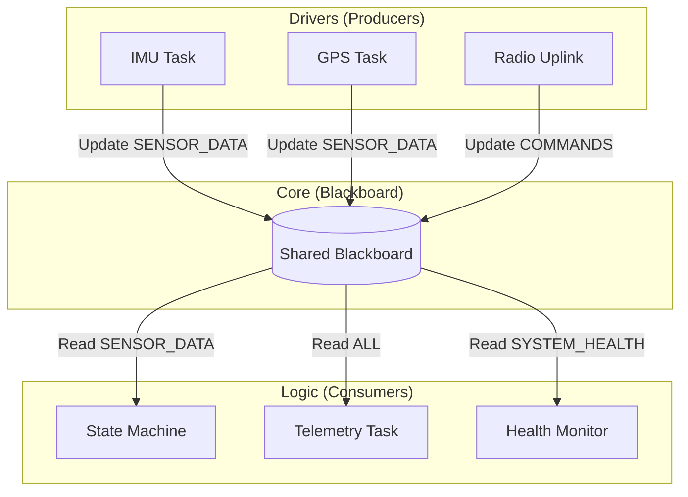
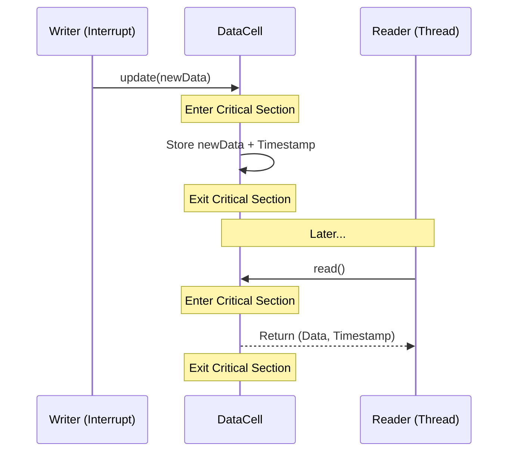
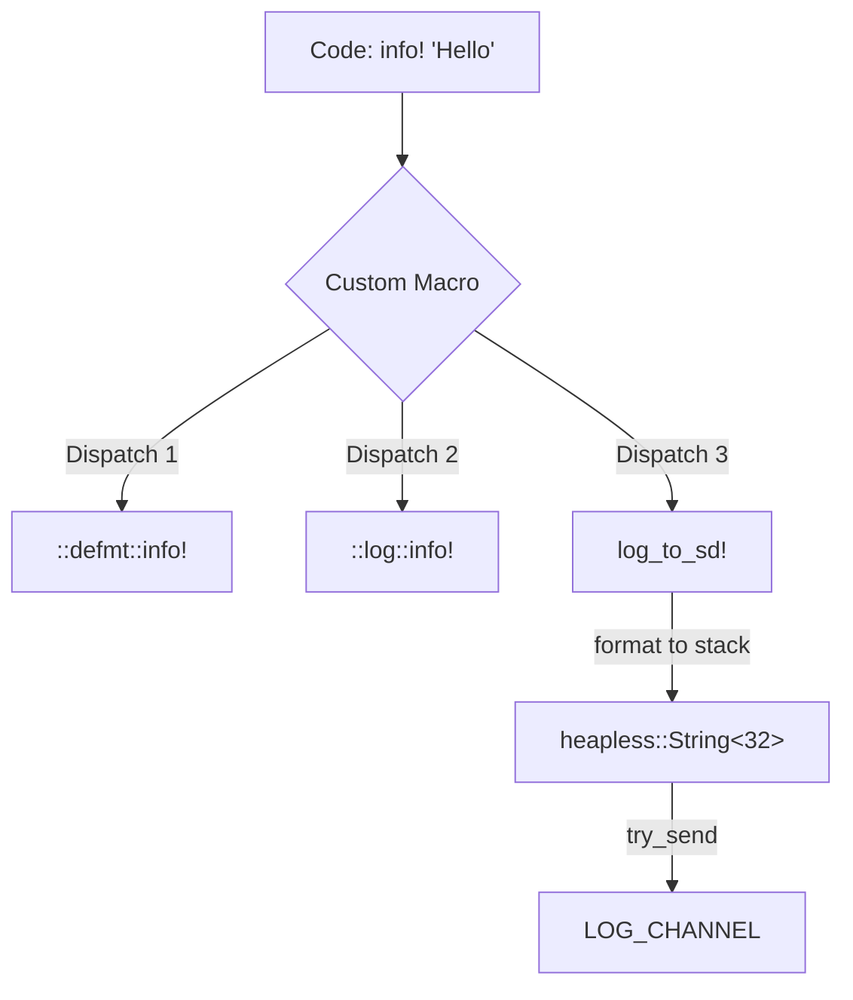

# rocket-core

This crate is the "brain" of the `rocket_vR` firmware. It defines the shared data structures, health monitoring types, and the high-level flight state machine that coordinate all other modules.

## Requirements

- **Architecture**: Architecture-agnostic (pure Rust `no_std`).
- **Critical Section**: Requires a `critical-section` implementation for the thread-safe `DataCell` synchronization.
- **Dependencies**: `embassy-sync`, `portable-atomic`, `fixed` (for fixed-point math).
- **Environment**: `no_std`, zero-allocation (`alloc` not required).

## System Engineering Requirements

The core module must satisfy the following design goals:

1.  **Thread-Safe Communication**: The `Blackboard` MUST allow concurrent access from any core or interrupt level without causing data races.
2.  **Atomicity**: `DataCell` updates MUST be atomic; a reader MUST never see a "partial" update where only some fields of a struct are changed.
3.  **Deterministic Math**: All flight-critical calculations (e.g., Kalman filtering, utilization) MUST use fixed-point arithmetic (`DeciPercent`) to ensure consistency across different MCUs.
4.  **Decoupled Modules**: Drivers and the State Machine MUST NOT communicate directly; they MUST interact through the `Blackboard` to maintain modularity.
5.  **Low Latency**: Blackboard access MUST be O(1) and non-blocking (using only `CriticalSection` locks for brief periods).

## Key Patterns

### 1. The Blackboard Pattern
The project uses a global `Blackboard` (defined in `blackboard.rs`) as a central hub for all system state. 



### 2. DataCell Synchronization
`DataCell<T>` is the primitive used for all blackboard fields. It wraps a data structure in a `Mutex` + `Cell` to provide safe `no_std` shared mutability.



### 3. Logging & Telemetry
A high-throughput, asynchronous logging pipeline designed for flight data persistence.

#### The Pipeline
Drivers and tasks act as **Producers**, asynchronously sending `LogEntry` items to a centralized **Global Channel**. The `SdLogger` task acts as the **Consumer**, draining the channel and flushing it to the SD card.

```mermaid
graph LR
    subgraph Producers
        IMU[IMU Task]
        GPS[GPS Task]
        SM[State Machine]
    end

    subgraph "Core (rocket-core)"
        LC[("LOG_CHANNEL (128 Items)")]
    end

    subgraph "Consumer (rocket-drivers)"
        SDL[SdLogger Task]
        BUF[LogBuffer (512B)]
        SD[(SD Card)]
    end

    IMU -->|try_send| LC
    GPS -->|try_send| LC
    SM  -->|try_send| LC

    LC -->|drain| SDL
    SDL -->|format CSV| BUF
    BUF -->|block-aligned write| SD
```

#### CSV Schema & Headers
To minimize storage and processing overhead, logs are stored as raw ASCII/CSV rows. Every log file (e.g., `LOG_001.CSV`) begins with a **Metadata Header** that defines the sampling rate (`TICK_HZ`) and the schema for every tag (e.g., `I`, `G`, `CPUH`).

- **Format**: `TAG,TIMESTAMP,PAYLOAD...`
- **Example**: `I,12345,1.2,0.5,-9.8` (IMU data at tick 12345)
- **Dropped Logs**: If the channel fills up, a global `DROPPED_LOGS` counter is incremented and reported in the periodic `LoggerHealth` entries.

### 4. Invisible Logging Macros
The project shadows standard Rust logging macros (`info!`, `warn!`, `error!`) to provide "invisible" persistence. When you call `info!("System Ready")`, the data is automatically dispatched to multiple sinks.

#### Triple Dispatch Model
A single macro call sends data to RTT for live debugging and the SD card for post-flight analysis simultaneously.



- **Standard Macros**: `info!`, `warn!`, `error!` — Dispatched to **all** sinks (RTT + Log + SD).
- **Local Macros**: `local_info!`, `local_warn!`, `local_error!` — Dispatched only to **live** sinks (RTT + Log). Use these for high-frequency or transient debugging.
- **`log_to_sd!`**: An internal macro that handles formatting into a stack-allocated string buffer. If the telemetry channel is full, the log is dropped and the global `DROPPING_LOGS` counter is incremented.

## Features

- **Fixed-Point Health**: `DeciPercent` (0.1% resolution) used for CPU and sensor health tracking.
- **Robust Logging**: Internal log channel (`Loggable`) with different tags for system, radio, and error events.
- **Kalman Filtering**: 1D vertical Kalman filter for altitude/velocity estimation based on barometer and acceleration data.
- **Flight State Machine**: High-level states (Launch, Ascent, Descent) driven by sensor data stored in the blackboard.
