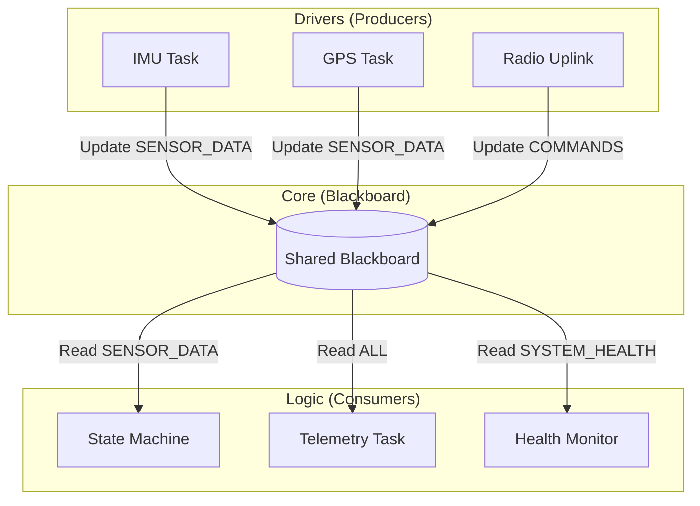
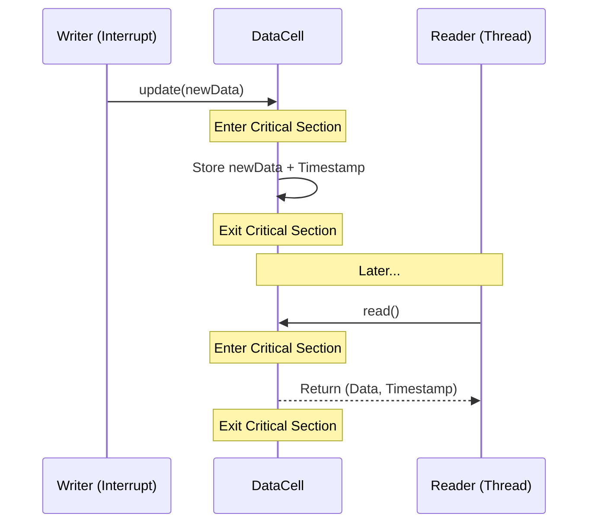

# rocket-core

This crate is the "brain" of the `rocket_vR` firmware. It defines the shared data structures, health monitoring types, and the high-level flight state machine that coordinate all other modules.

## Requirements

- **Architecture**: Architecture-agnostic (pure Rust `no_std`).
- **Critical Section**: Requires a `critical-section` implementation for the thread-safe `DataCell` synchronization.
- **Dependencies**: `embassy-sync`, `portable-atomic`, `fixed` (for fixed-point math).
- **Environment**: `no_std`, zero-allocation (`alloc` not required).

## System Engineering Requirements

The core module must satisfy the following design goals:

1.  **Thread-Safe Communication**: The `Blackboard` MUST allow concurrent access from any core or interrupt level without causing data races.
2.  **Atomicity**: `DataCell` updates MUST be atomic; a reader MUST never see a "partial" update where only some fields of a struct are changed.
3.  **Deterministic Math**: All flight-critical calculations (e.g., Kalman filtering, utilization) MUST use fixed-point arithmetic (`DeciPercent`) to ensure consistency across different MCUs.
4.  **Decoupled Modules**: Drivers and the State Machine MUST NOT communicate directly; they MUST interact through the `Blackboard` to maintain modularity.
5.  **Low Latency**: Blackboard access MUST be O(1) and non-blocking (using only `CriticalSection` locks for brief periods).

## Key Patterns

### 1. The Blackboard Pattern
The project uses a global `Blackboard` (defined in `blackboard.rs`) as a central hub for all system state. 

### 2. DataCell Synchronization
`DataCell<T>` is the primitive used for all blackboard fields. It wraps a data structure in a `Mutex` + `Cell` to provide safe `no_std` shared mutability.

## Features

- **Fixed-Point Health**: `DeciPercent` (0.1% resolution) used for CPU and sensor health tracking.
- **Robust Logging**: Internal log channel (`Loggable`) with different tags for system, radio, and error events.
- **Kalman Filtering**: 1D vertical Kalman filter for altitude/velocity estimation based on barometer and acceleration data.
- **Flight State Machine**: High-level states (Launch, Ascent, Descent) driven by sensor data stored in the blackboard.
