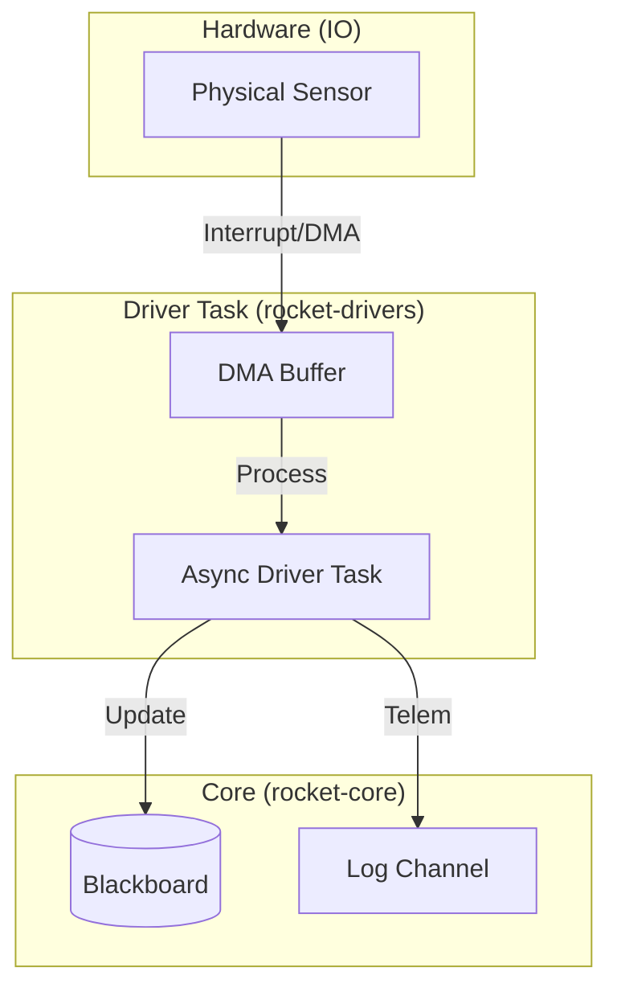
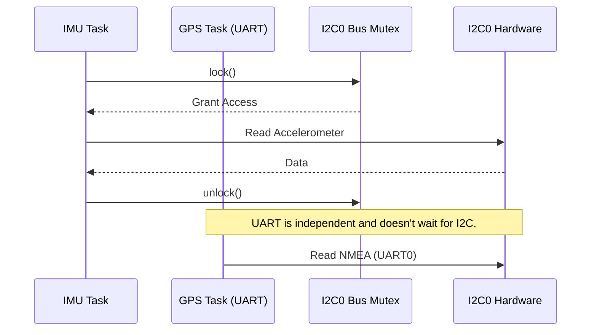

# rocket-drivers

This crate handles all external hardware interaction for the `rocket_vR` firmware. It provides async drivers for sensors, telemetry radios, and storage devices.

## Technical Stack & Design

| Category | Implementation | Benefit |
| :--- | :--- | :--- |
| **HAL** | `embassy-rp` + `embedded-hal-async` | Modern, non-blocking peripheral access. |
| **DMA** | Integrated DMA for SPI/UART/PIO | Zero-CPU overhead for large data transfers. |
| **Buses** | Shared SPI/I2C via `embassy-sync` Mutexes | Thread-safe access to multi-device buses. |
| **Architecture** | "Driver Task -> Blackboard" Pattern | Decoupled sensor sampling and logic execution. |
| **Safety** | Per-driver watchdogs and bus recovery | System continues to fly if a single sensor hangs. |

---

> [!TIP]
> **Pro-Tip**: All drivers in this crate use **DMA (Direct Memory Access)** for transfers over 16 bytes. This keeps the CPU high-priority thread-mode free to handle flight logic while IO happens in the background.

## Requirements

- **Architecture**: `thumbv6m` (RP2040) or `thumbv8m` (RP2350).
- **Peripherals**: 1x I2C, 2x SPI, 1x UART, 1x USB, 6+ DMA Channels.
- **Dependencies**: `embassy-rp`, `embedded-hal`, `rocket-core`.

## System Engineering Requirements

The driver module must satisfy the following design goals:

1.  **Non-Blocking IO**: No driver call SHALL block the executor for more than 10μs. Long transfers MUST be async.
2.  **Bus Isolation**: Failure of a device on SPI0 MUST NOT prevent the operation of devices on SPI1 or I2C0.
3.  **Deterministic Sampling**: Sensor sampling tasks SHOULD target a jitter of <1ms for 100Hz IMU loops.
4.  **Automatic Recovery**: Drivers MUST attempt to recover (re-init) if a sensor reports persistent I/O errors.
5.  **DMA Integrity**: Critical flight data (IMU) MUST use DMA to ensure no data is lost during high-priority interrupt bursts.
6.  **Hardware Anonymity**: Drivers MUST be peripheral-agnostic. They SHOULD take generic instances (e.g., `<SPI: Instance>`) to allow reuse across different pinouts and hardware (Rocket vs. Base Station).

## Known Exceptions

### SD Card Blocking I/O
The SD Card driver (using `embedded-sdmmc`) is currently **synchronous/blocking**.
- **Impact**: When the `SdLogger` flushes its buffer to the SD card (every 5 seconds or 512 bytes), it will block its executor for the duration of the SPI transfer (typically 5-50ms).
- **Risk**: If the SD card task shares a core with the high-priority IMU sampling task, it may cause jitter in the sampling frequency.
- **Mitigation**: The SD card task SHOULD be assigned to Core 0, while the high-priority control loop remains on Core 1.

### Hardware Anonymity Violations
Some drivers currently hardcode specific RP2040/RP2350 peripherals, preventing easy reuse on alternative hardware configurations:
- **Radio Driver**: Hardcoded to `SPI1`.
- **SD Card Driver**: Hardcoded to `SPI0`.
- **Mitigation**: These should be refactored to use generic `<SPI: Instance>` parameters, identical to the pattern used in `imu_task_driver`.

### 1. Driver Task Flow
Drivers operate as independent tasks. They sample hardware at a configured frequency and "push" the results into the **Global Blackboard**.

### 2. Shared Bus Synchronization
Multiple devices often share a single physical SPI or I2C bus. We use `embassy_sync::blocking_mutex` or `embassy_sync::mutex` to ensure only one driver controls the bus at a time.

## Hardware Resource Mapping

| Peripheral | Resource | Pins (TX/RX or SCL/SDA) | DMA Channels |
| :--- | :--- | :--- | :--- |
| **GPS** | `UART0` | GPIO 12/13 | `DMA_CH1`, `DMA_CH2` |
| **IMU** | `I2C0` | GPIO 5/4 | (PIO Driven) |
| **Radio** | `SPI1` | GPIO 11/8/10 (CS: 9) | `DMA_CH5`, `DMA_CH6` |
| **SD Card** | `SPI0` | GPIO 19/16/18 (CS: 17) | `DMA_CH3`, `DMA_CH4` |
| **WiFi** | `PIO0` | GPIO 25/24/29 (CS: 25) | `DMA_CH0` |
| **USB** | `USB` | Internal | N/A |
