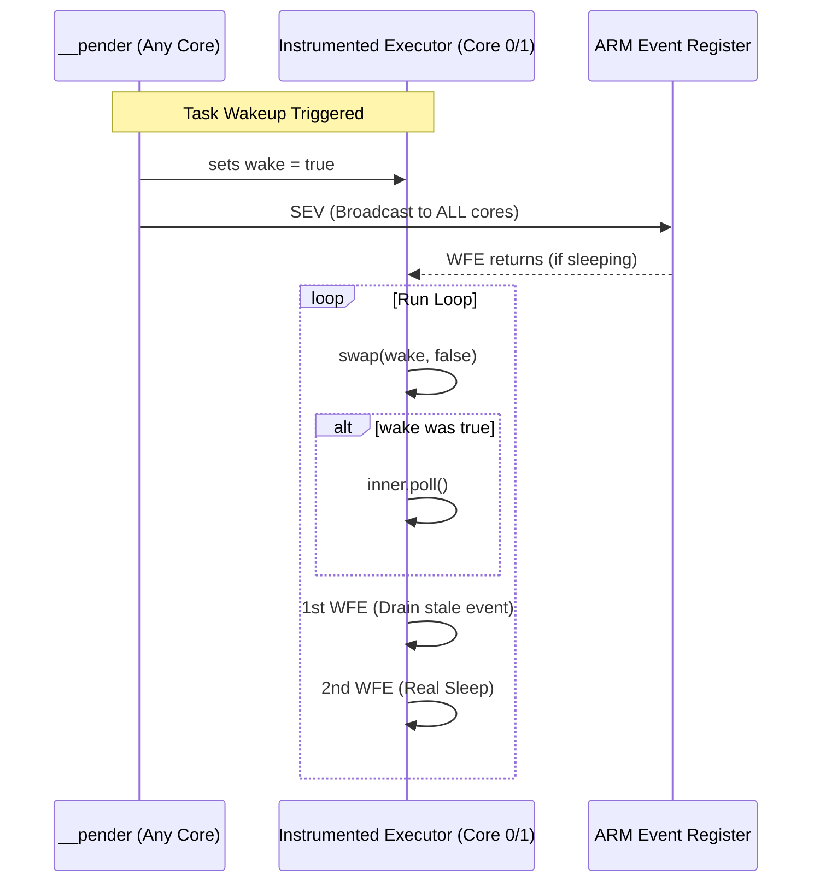
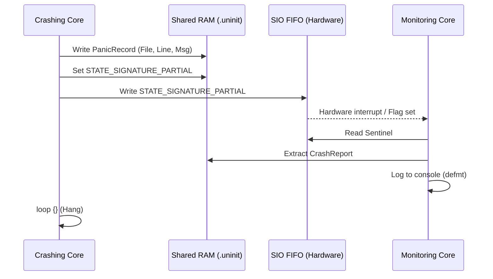

# rocket-os

This crate provides the core "Operating System" abstractions for the `rocket_vR` firmware, specifically tailored for the RP2350 (Cortex-M33) dual-core architecture.

## Features

### 1. Instrumented Embassy Executor
A custom Embassy executor that solves the "spurious wakeup" and "ping-pong" problems unique to dual-core ARM Cortex-M systems.



- **Wake-Gate Logic**: Uses a software gate to filter out spurious wakeups caused by atomic operations in the run-queue.
- **Dual-Core Efficiency**: Replaces the broadcast `SEV` (Send Event) with a double `WFE` (Wait For Event) drain pattern, preventing Core 0 from accidentally waking Core 1 and vice versa.
- **Utilization Tracking**: Automatically tracks `idle_ticks` and `poll_count` per core for accurate CPU load monitoring.

### 2. Robust Panic Handling
A high-reliability panic and hard-fault handler designed for cross-core visibility.



- **Bidirectional Monitoring**: Core 0 monitors Core 1, and Core 1 monitors Core 0.
- **Hardware Signaling**: Uses the RP2350 SIO FIFO as a hardware-level sentinel for immediate crash detection.
- **Post-Mortem Logs**: Stores panic information (file, line, message) in `.uninit` RAM, allowing the system to report crash details after an automatic reboot.
- **`addr2line` Integration**: Includes instructions for resolving stack traces using the project binary.

### 3. System Health Monitoring
Background tasks for real-time diagnostics.

- **CPU Utilization**: Calculates total load, interrupt-mode load, and per-task load in tenths of a percent (0.1% resolution).
- **Stack Watermarking**: Monitors the high-watermark of the stack on both cores to prevent overflows.
- **Heartbeat Monitoring**: Tracks the liveness of critical subsystems (IMU, GPS, Radio).

## Usage

### Setting up the Executor

In your `main.rs`, define the executors for both cores:

```rust
static METRICS_C0: ExecutorMetrics = ExecutorMetrics::new();
static mut EXECUTOR_C0: InstrumentedExecutor = InstrumentedExecutor::new(&METRICS_C0);

#[embassy_executor::main]
async fn main(spawner: Spawner) {
    // Core 0 logic...
    unsafe { EXECUTOR_C0.run(|spawner| { ... }) };
}
```

### Enabling Verbose Stats
Build with the `verbose-utilization` feature to see second-by-second reports in the console:

```powershell
cargo run-pico2 --features verbose-utilization
```
